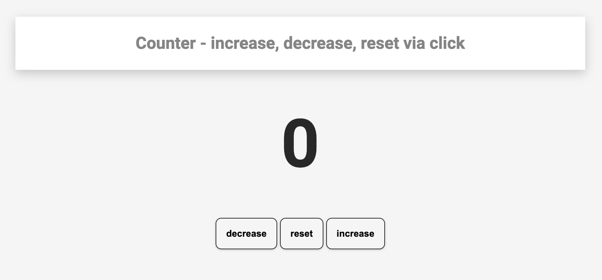
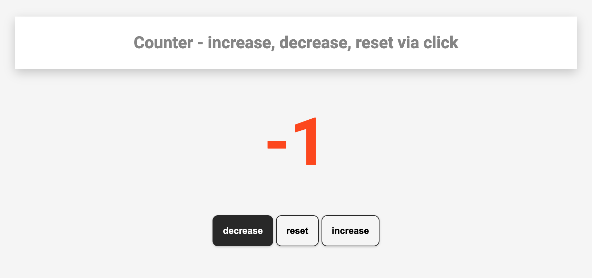
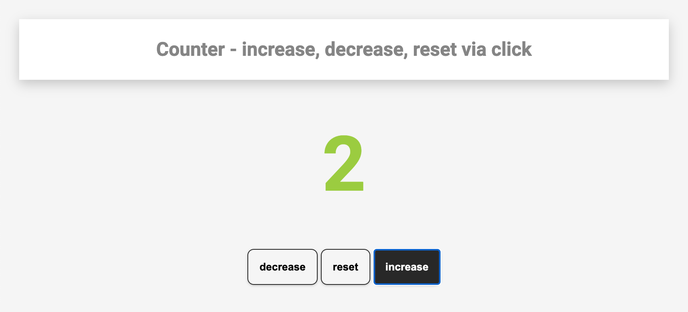
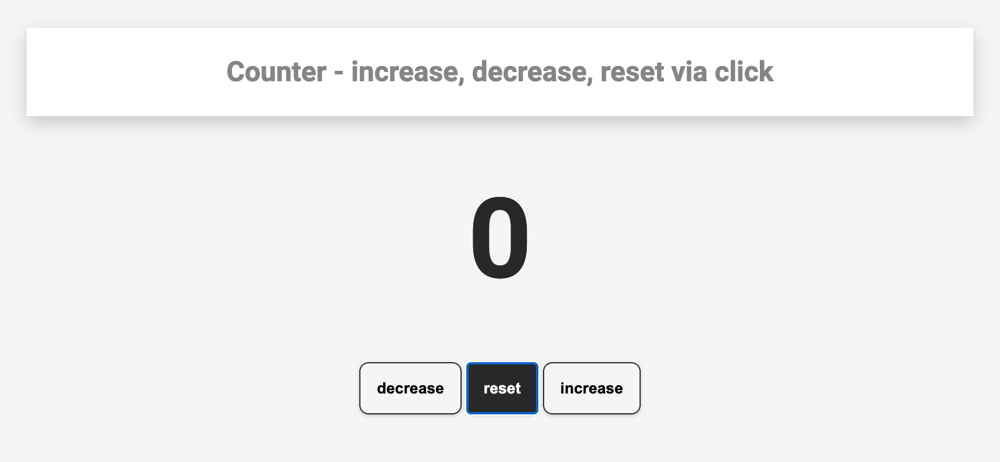

# Counter

## What is this about?

A simple counter, decreasing, increasing, resetting `0` via click on button.

### Sources

- Starting point: [FreeCodecamp article - 40 JavaScript courses for Beginners](https://www.freecodecamp.org/news/javascript-projects-for-beginners/)
- See this link for [the counter part in that article](https://www.freecodecamp.org/news/javascript-projects-for-beginners/#how-to-create-a-counter)

Author/Creator of that counter is John Smilga

- [YouTube video counter](https://www.youtube.com/watch?v=3PHXvlpOkf4&t=1825s)
- [John Smilga's counter on GitHub](https://github.com/john-smilga/javascript-basic-projects/tree/master/02-counter)
- [Overview of the JavaScript projects, John Smilga created](https://www.vanillajavascriptprojects.com/)

### Visuals - what you get with this code

### Tech

- simple HTML, CSS, JavaScript, no build process

### How to run this?

- clone the repo
- cd into project
- open `index.html` in your browser of choice
